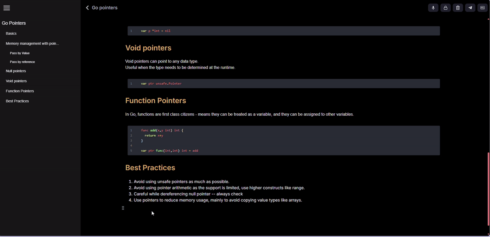

<div align="center">

<h1>
<code>Snippets</code>
<br clear="all">
<a href="/LICENSE"></a>
</h1>

**[Features] • [Deployment] • [Usage]**

[Features]: #features
[Deployment]: #deployment
[Usage]: /docs/USAGE.md


<p></p>

</div>

`Snippets` is a note taking web application designed to strip away unnecessary visual noise found in traditional note-taking tools. It's interface keeps users focused on the core task — capturing notes.

## Features

<details>
<summary>
<code>snippets</code> supports <code>rich text editing</code>.
</summary><p></p>


</details>

<details>
<summary>
<code>Auto Save & Backup</code> 
</summary>
<code>Snippets</code> seamlessy backs up your notes to the cloud.
</details>

<details>
<summary>
<code>Code execution</code>
</summary>
<p></p>
Snippets was designed to support code execution for the code blocks. In the current version, this feature only works for <code>Javascript</code> (This feature will be included in upcoming updates).
</details>

## Deployment

- Clone the repository
```bash
git clone https://github.com/prudhvideep/Snippets.git
```

- Install dpendencies

```bash
pnpm install
```

- Configure environment variables for `Neon` and `Firebase`

```bash
VITE_DATABASE_URL = *Your Neon Db Url*

#firebase keys
VITE_FIREBASE_API_KEY =
VITE_AUTH_DOMAIN = 
VITE_PROJECT_ID = 
VITE_STORAGE_BUCKET = 
VITE_MESSAGING_SENDER_ID = 
VITE_APP_ID = 
```

- Start the development server

```bash
pnpm dev
```